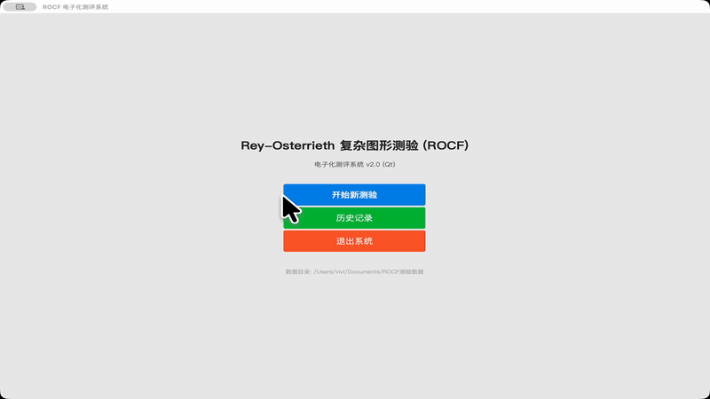

# ROCF Test

Rey-Osterrieth Complex Figure (ROCF) 测验应用 — 一个基于 PsychoPy 等开源工具开发的跨平台视觉记忆评估工具。

## 功能

- 显示 ROCF 复杂图形供受试者观察
- 自动计时（观察阶段）
- 间隔后进入默画阶段，记录绘制时间
- 生成测验结果报告

## 安装

```bash
pip install PySide6
```

或使用自动依赖安装脚本：

```bash
python scripts/install_deps.py
```

## 使用

```bash
python assets/rocf_qt.py
```

## 作为 Marvis Skill 使用

本仓库也是一个标准的 Marvis Skill。将仓库克隆到 skills 目录后，即可通过 `use_skill("rocf-test")` 在 Agent 中直接调用。

```bash
# 安装为 Marvis skill
npx skills add <repository-url> -g -y
```

## Skill 触发条件

当用户提到以下关键词时自动激活：
- 瑞氏复杂图形测验 / ROCF / Rey-Osterrieth / 视觉记忆测验

## 跨平台支持

- macOS
- Windows
- Linux

## 目录结构

```
rocf-test/
├── README.md
├── assets/
│   └── rocf_qt.py
├── src/
├── config/
└── docker/
```

## 演示视频

参见 [ROCF 功能演示视频](ROCF_演示视频.mp4)



## License

MIT
