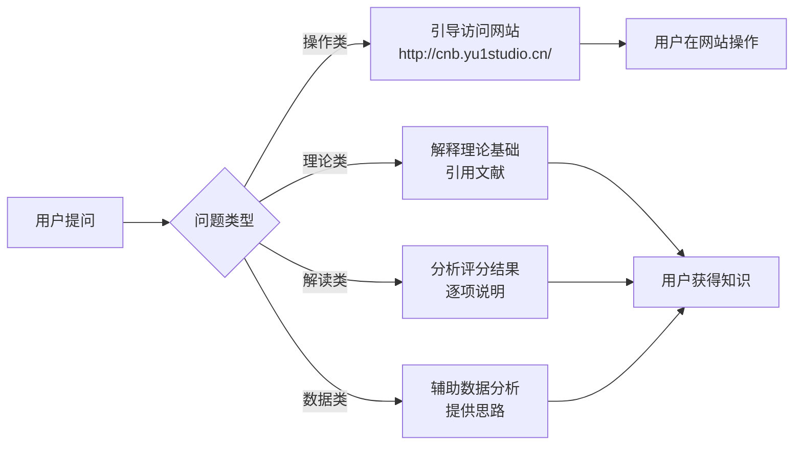

---
AIGC:
    Label: "1"
    ContentProducer: 001191440300708461136T1XGW3
    ProduceID: bed9e04a7fbdd413e715ac8d103dd66b_48555f218b2311f19c1f525400f8a581
    ReservedCode1: 6KRw33RBLFg2O5WDFsNc2w+katVacLrnlpYjAK/ckJhIy5wBj1sdUf5CY7Yl/8O6vI0N2TvFQsKOIUqIFhWSs0LNZOuF/GNdseNUHiSxyFqerEA81CmWaQmaP9yePgy7kGE+9nn6+apX+Xefvdx6pO0o6CbFkqGiZVARJDh7qtR8/xTKt4beAtUqwjg=
    ContentPropagator: 001191440300708461136T1XGW3
    PropagateID: bed9e04a7fbdd413e715ac8d103dd66b_48555f218b2311f19c1f525400f8a581
    ReservedCode2: 6KRw33RBLFg2O5WDFsNc2w+katVacLrnlpYjAK/ckJhIy5wBj1sdUf5CY7Yl/8O6vI0N2TvFQsKOIUqIFhWSs0LNZOuF/GNdseNUHiSxyFqerEA81CmWaQmaP9yePgy7kGE+9nn6+apX+Xefvdx6pO0o6CbFkqGiZVARJDh7qtR8/xTKt4beAtUqwjg=
---

# ROCF 智能体设计与开发文档

> **项目名称**：ROCF 智能评估助手（ROCF Intelligent Assessment Agent）  
> **版本**：v2.0  
> **日期**：2026-07-29  
> **基于项目**：ROCF 电子测评系统 v0.1  
> **联合开发**：广西幼儿师范高等专科学校艺术设计专业团队 与 顽主（天津）教育科技有限责任公司

---

## （一）功能说明

### 1.1 智能体名称

**ROCF 智能评估助手**（ROCF Intelligent Assessment Agent），简称 **ROCF-Agent**。

### 1.2 定位

ROCF-Agent 是一款面向**高校心理学教学与认知评估研究**场景的智能辅助体。核心程序已部署为网页应用 **[ROCF 电子测评系统](http://cnb.yu1studio.cn/)**，用户可直接在浏览器中打开并使用。

本智能体的角色定位是 **引导者 + 辅助者**，而非执行者。其在系统中的架构位置如下：

```
┌─────────────────────────────────────────────┐
│             ROCF 电子测评系统                │
│         http://cnb.yu1studio.cn/             │
│  （图形呈现 / 施测 / 采集 / 评分 / 报告）    │
│                    ▲                         │
│                    │ 引导访问 + 解读结果      │
│               ┌────┴────┐                    │
│               │ROCF-Agent│ ← 智能辅助层       │
│               └─────────┘                    │
│  （理论解释 / 结果解读 / 数据分析 / 使用指导） │
└─────────────────────────────────────────────┘
```

属于**领域专用智能体（Domain-Specific Agent）**，专注于 Rey-Osterrieth 复杂图形测验相关知识的教育传播与结果解读。

### 1.3 能力配置：网站已有 vs 智能体附加

| 类别 | 能力 | 归属 | 说明 |
|------|------|------|------|
| **网站已有** | ROCF 图形呈现与施测 | 网页应用 | 浏览器中完成临摹、干扰、回忆三阶段 |
| **网站已有** | 描画轨迹采集 | 网页应用 | 约 60 Hz 笔画数据记录 |
| **网站已有** | Osterrieth 36 分自动评分 | 网页应用 | 18 单元 0/1/2 评分引擎 |
| **网站已有** | 组织策略自动判定 | 网页应用 | 整体式/零散式/中间型 |
| **网站已有** | 报告生成与导出 | 网页应用 | 结构化评估报告 |
| **智能体** | 引导用户访问网站 | ROCF-Agent | 用户提出测试需求时导航到 cnb.yu1studio.cn |
| **智能体** | ROCF 理论基础讲解 | ROCF-Agent | 历史、18 单元体系、策略分类、保留百分比 |
| **智能体** | 评分结果解读 | ROCF-Agent | 得分含义、分项分析、策略意义 |
| **智能体** | 数据分析辅助 | ROCF-Agent | 导出数据结构说明、统计分析思路 |
| **智能体** | 使用指导与答疑 | ROCF-Agent | 参数建议、教学场景、常见问题 |

### 1.4 目标用户群体

| 用户群体 | 使用场景 | 核心需求 |
|----------|----------|----------|
| **高校心理学专业师生** | 实验心理学课程教学、标准化施测学习 | 理解 ROCF 理论基础、学会解读评分结果、掌握标准化施测流程 |
| **认知评估研究人员** | 论文数据采集、群体差异研究 | 数据分析思路辅助、结果解读、研究设计建议 |

### 1.5 拟解决的教育与研究场景问题

1. **理论基础薄弱**：学生对 ROCF 的评分体系和策略分类理解不深，ROCF-Agent 提供即时的理论解释与参考来源。

2. **评分结果看不懂**：自动评分后缺乏专业解读，ROCF-Agent 帮助逐项分析 18 单元得分、保留百分比和策略类型。

3. **数据分析无从下手**：研究人员导出 JSON 数据后不确定如何开展统计分析，ROCF-Agent 提供分析框架建议。

4. **使用门槛**：新用户不知道如何开始，ROCF-Agent 直接引导到网站并提供操作指引。

---

## （二）场景与工作流设计

### 2.1 核心工作流

ROCF-Agent 的工作流为**用户提问 → 智能体响应 → 用户操作网站** 的三段式：



### 2.2 具体场景

#### 场景一：学生询问 ROCF 理论基础

**流程**：学生问"ROCF 的 18 单元分别是什么" → Agent 列出 18 单元编号、名称与评分标准 → 引用 Osterrieth (1944) 作为来源 → 引导学生去网站实际操作体验。

#### 场景二：教师需要结果解读

**流程**：教师提供评分数据（临摹 28，回忆 20，策略 piecemeal） → Agent 解读：临摹得分尚可但回忆保留 71.4%，零散式策略提示被试采用的是逐元素加工方式而非整体编码 → 建议关注特定单元的分项得分差异。

#### 场景三：研究者需要数据分析思路

**流程**：研究者询问"导出的 JSON 数据怎么用 SPSS 分析" → Agent 说明数据结构，建议提取关键变量（临摹得分、回忆得分、保留百分比、策略类型、耗时）→ 提供描述统计与组间比较的分析框架 → 提醒数据合规与伦理要求。

#### 场景四：新用户不知道如何开始

**流程**：用户说"我想做一次 ROCF 测验" → Agent 回复"ROCF 电子测评系统已部署在 http://cnb.yu1studio.cn/ ，直接在浏览器中打开即可完成全流程施测和评分" → 简要说明网站操作步骤。

---

## （三）能力配置说明

### 3.1 智能体核心能力

| 能力 | 实现方式 | 依赖 |
|------|----------|------|
| **网站导航引导** | 直接提供 URL http://cnb.yu1studio.cn/ ，必要时附操作步骤说明 | 无（纯文本引导） |
| **理论讲解** | 基于内嵌领域知识（Osterrieth 1944, Savage 2000 等文献） | 领域知识库 |
| **结果解读** | 根据用户提供的评分数据进行专业分析 | 用户输入数据 |
| **数据分析辅助** | 解释导出 JSON 的各字段含义，提供统计方法建议 | 用户导出的数据 |

### 3.2 网站参数（供智能体引导时参考）

用户在网站上可调整的关键参数：

| 参数 | 默认值 | 建议 |
|------|--------|------|
| 临摹时长 | 600 秒 | 课堂场景可缩短至 300 秒 |
| 回忆时长 | 600 秒 | 研究场景建议保持默认 |
| 干扰任务 | 60 秒 | 标准流程建议不变 |

### 3.3 知识库 / 数据集成说明

ROCF-Agent 为**纯文本对话智能体**，不执行代码、不调用 API。其知识来源为：

- **领域文献**：Osterrieth (1944)、Savage 等 (2000)、Rey (1941) 等经典文献的核心结论
- **程序文档**：ROCF 电子测评系统的功能说明与参数配置

网站本身为完全本地化运行的网页应用，不依赖网络连接。智能体仅通过文本对话提供服务，不读取网站数据、不操作网站界面。

### 3.4 数据合规与隐私

| 合规维度 | 措施 |
|----------|------|
| **数据本地化** | 网站数据默认存储于用户本地，Agent 不接触任何被试数据 |
| **隐私保护** | Agent 对话中不请求、不存储被试真实姓名或个人信息 |
| **知情同意** | 引导用户在网站上确认知情同意声明 |

---

## 附录

### 附录 A：网站技术栈概要

| 层级 | 技术选型 | 说明 |
|------|----------|------|
| 前端 | PySide6 (Qt 6) Web 部署 | 跨平台网页应用 |
| 图形渲染 | QPainter + QPainterPath | 矢量渲染，支持抗锯齿 |
| 数据存储 | JSON + PNG | 结构化数据本地持久化 |
| 部署地址 | http://cnb.yu1studio.cn/ | 浏览器直接访问 |

### 附录 B：主要参考文献

1. Rey, A. (1941). L'examen psychologique dans les cas d'encéphalopathie traumatique. *Archives de Psychologie*, 28, 286–340.
2. Osterrieth, P. A. (1944). Le test de copie d'une figure complexe. *Archives de Psychologie*, 30, 206–356.
3. Savage, C. R., et al. (2000). Organizational strategies mediate nonverbal memory impairment in obsessive-compulsive disorder. *Biological Psychiatry*, 45(7), 905–916.

---

*本文档由 ROCF 智能评估助手项目组编制，基于 ROCF 电子测评系统 v0.1 实际功能如实撰写。*
*（内容由AI生成，仅供参考）*
